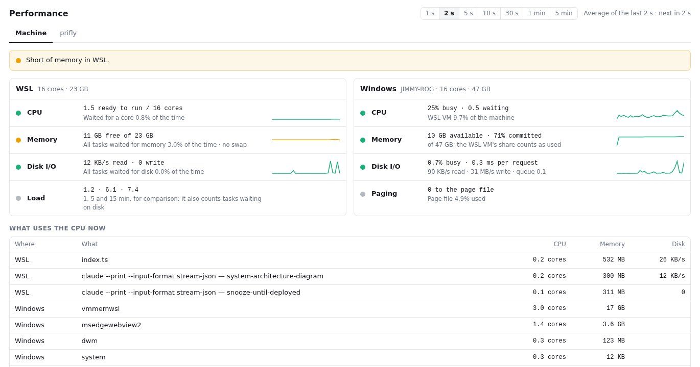
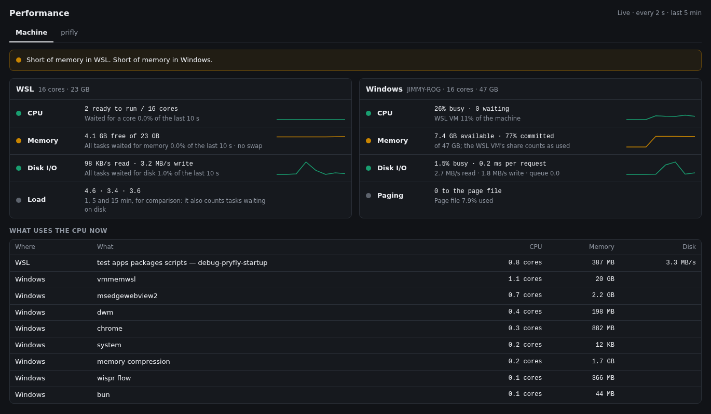
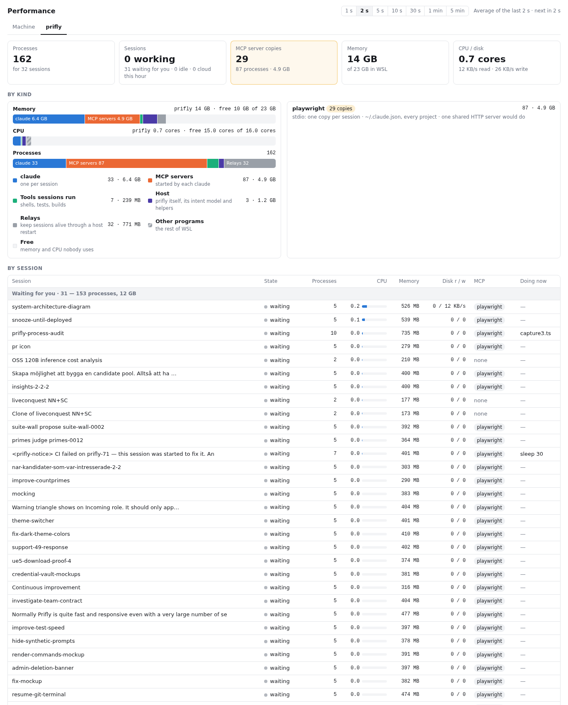

# Performance for prifly

Is this machine out of CPU, memory or disk, and what is using it? This
extension answers that in green, orange and red, for WSL and for the Windows
around it. A second tab answers the same question for prifly itself: how many
processes it runs, for which sessions, and how many MCP servers those sessions
started.

It adds one item to prifly's status bar: a **Performance** button whose icon
is green, orange or red for the worst of CPU, memory and disk over the last
10 s. Hover it for what is short ("Out of CPU in WSL") and each resource's
colour; click it for the window below, over nearly the whole of prifly. The
window's ↗ button opens it in a window of its own. (A prifly from before
2026-10-01 shows the colour as a separate chip beside the button.)



## Every second, or every five minutes

The window has a control for the period it averages over: 1 s, 2 s, 5 s, 10 s,
30 s, 1 min or 5 min (2 s to begin with, and it remembers your choice). It
repaints every second whatever the period, each time with the average of the
trailing period, and says so: *Average of the trailing 30 s, updated every
second*. So the numbers move every second but hold still: two repaints of a
30 s period share 29 of their seconds, and a 2 s spike counts for a fifteenth.
Before a period has filled it averages what there is and says so (*Average of
the last 8 s*).

- **Rates are exact.** CPU (per process, session and kind, and in total),
  disk read and write, and Linux's busy share are the change of a cumulative
  counter between the window's start and its end, over the time between. A
  process born mid-window counts what it used since its first sample, spread
  over the whole window; one that ended inside it is gone from the table.
- **Levels are means.** Available memory, the run queue, swap, load, the
  pressure figures (the kernel's own 10 s averages, averaged again) and
  Windows' counters are the mean of the one-second samples in the window.
- **Colours and the headline** are judged from the averaged numbers.
- **Sparklines** have one point per window: the last 60 that fit in the last
  hour.
- The status-bar colour always judges the last 10 s, with the window open or not.
  The busiest Windows processes are read every 10 s whatever the window.

## Machine

The headline names whatever is short or out, worst first. Under it, WSL and
Windows each get four rows, each with a colour, the reading, what it means,
and a sparkline of the averages:

| | WSL | Windows |
|---|---|---|
| **CPU** | tasks ready to run against cores, and how long they waited for one | % of the machine busy, the processor queue, and the WSL VM's share of the machine |
| **Memory** | available of total, time stalled waiting for memory, swap | available, committed, and the total |
| **Disk** | read and write rates, time stalled waiting for disk | % busy, time per request, rates, queue |
| last row | load average, uncoloured | writes to the page file, uncoloured |

**What uses the CPU now** lists the busiest processes on both sides. A WSL
process that belongs to a prifly session is named with that session.



### Graphics card

With an NVIDIA card (`nvidia-smi` on the PATH, or in `/usr/lib/wsl/lib`), a
full-width **Graphics card** card sits under WSL and Windows: free memory of
the total, whether dictation's grey words are on, would start or would not
(starting needs 1.5 GB free, or the `greyNeeds` the host writes in
`gpu-holders.json`; the dashed line on the bar), and who holds
the rest. Prifly's holders file decides first: while it lists a live grey
worker the words are **on**, whatever is free (the worker holds its own
memory); otherwise they **would start** when free memory reaches what they
need, and **would not** when it is short. Without the file (older host,
dictation not running, or older than ten minutes) free memory alone decides.
The headline says grey words would not start when they would not, unless CPU,
memory or disk is really short. Windows' per-process counters (`GPU Process Memory`)
count each process at most what it has committed (NVIDIA Overlay has claimed
34.9 GB dedicated on an 8 GB card), and a process listed more than once on
the card counts its largest instance: Windows programs' figures overlap, and
so are scaled down to fit in what the WSL VM leaves; `vmwp`, taken as counted,
is the WSL VM (one instance per WSL process using the GPU, so its instances
add up), split into prifly's model workers by `~/.local/share/prifly/gpu-holders.json`
(fresh, live pids only), else one "prifly (WSL)" bar. A worker whose entry
carries `parts` (`[{model, mib}]`, such as Parakeet and turbo in dictation's
final worker) is a row per model, the second one lighter. Under Why, a prifly
row says what its model does, then the model: "Detects which language you speak;
turns Swedish speech into text · whisper turbo". A `role` string on the entry or
on a part (the host's own words) is shown instead of the built-in sentence, and a
model nobody described shows its name alone. The workers' figures are
estimates, so the card also looks at which WSL processes have `/dev/dxg` (the
GPU) open: when only prifly's workers do, they share the whole of the VM's
figure and there is no "WSL other" row; when another process does, the
remainder is named after it (`python3 (pid 123)`, or "WSL other" with the list
under Why when there are more than three). Where `/proc` cannot be scanned
the remainder stays "WSL other". Only this distro's processes are visible:
GPU use in another distro or in Docker Desktop's own is part of the VM's
figure but cannot be named, so while no local process but prifly's workers has
the GPU open it is counted into them. Read only while the window is open.

### When it turns orange or red

| | Orange | Red |
|---|---|---|
| WSL CPU: tasks waiting for a core (PSI `cpu some`) | 10 % of the time | 40 % |
| WSL memory: every task stalled on memory (PSI `memory full`) | 5 % | 20 % |
| WSL memory: some task stalled on memory (PSI `memory some`) | 20 % | — |
| WSL memory: available | under 20 % | under 10 % |
| WSL disk: every task stalled on disk (PSI `io full`) | 5 % | 20 % |
| Windows CPU: processor queue per core | 1 | 2 |
| Windows memory: committed | 90 % | 97 % |
| Windows memory: writes to the page file | 1 MB/s | 10 MB/s |
| Windows memory: available | under 10 % or 2 GB | under 5 % or 1 GB |
| Windows disk: time per read or write | 15 ms | 25 ms |

On Linux the colours come from [pressure stall
information](https://docs.kernel.org/accounting/psi.html), not from how busy
something is. PSI measures how long tasks actually waited, which is what makes
a machine feel slow. The share is taken from PSI's time stalled since boot at
both ends of the window you pick, so it covers exactly that window. Load average is shown without a colour because Linux also
counts tasks waiting on disk in it. Without PSI, a run queue of more than twice
the cores stands in for CPU.

Windows memory is judged mainly by commit charge (can Windows still hand
memory out?) and by writes to the page file (is it pushing memory out to make
room?). Low available memory counts only when it is truly low. The WSL VM
keeps its own file cache, which Windows counts as used, so 18 % available with
70 % committed and no paging is a calm machine.

For CPU and disk, the Windows thresholds are the usual Performance Monitor
guidance. One
rule from that guidance is left out on purpose: "`Pages Input/sec` under 15"
dates from spinning disks. An NVMe laptop reads thousands a second with
nothing wrong (4,195 measured on the machine this was written on).

## prifly



- **Tiles**: processes, sessions working and idle (plus cloud sessions active
  this hour), MCP server copies, memory, and CPU and disk.
- **By kind**: stacked bars for memory, CPU and processes, split into each
  session's `claude`, MCP servers, the tools turns run (shells, tests,
  builds), the Docker containers sessions started, the host with its helpers,
  and the relays that keep sessions alive through a host restart. The memory
  and CPU bars span the whole of WSL, so what lies outside prifly (striped)
  and what is free (the empty track) show beside prifly's share: containers no
  session started, the kernel's interrupts (CPU only), and other programs,
  which is what is left.
- **Containers**: Docker Desktop runs containers in a distro of its own, so
  no process table here shows them. Their CPU and memory come from their
  cgroups instead, which the WSL VM shares with every distro
  (`/sys/fs/cgroup/docker/<id>`), and their names and mounts from Docker's
  API. A container belongs to the session whose scratchpad it mounts, or else
  to the one session whose folder holds its mounts or compose project. One in a
  folder several sessions share, or in none, is "other containers". A
  session's containers count in its row, and show as chips under *Doing now*.
  Docker hides a container's processes, so containers count as one each, not
  in the process bar.
- **MCP servers**: each server, how many copies run, and what they cost. A
  stdio server (configured as a `command`) runs once per session, so 25
  sessions means 25 copies. An HTTP server (a `url`) runs once for all of them
  and costs nothing here. The tile turns orange when one server runs more than
  one copy.
- **By session**: each session's processes, CPU, memory, disk, MCP servers
  and the busiest program its turn is running now, grouped into working,
  waiting for you, idle at their prompt, and other.

Cloud sessions run on Anthropic's machines and their MCP servers run in that
sandbox, so they add no processes here. They are only counted.

## Nanny

When WSL's CPU or memory has been turned orange or red by sessions' tools, the
extension says whose. On 2026-10-04 the laptop ran at load 111–139 on 16 cores
because benchmarks, `bun test` gates and `ty --watch` from different sessions
piled up, and only the reader noticed. It reads the process table every 5 s
while the 10 s verdict is not green (window open or not), averages it over 30 s,
and sums what each session's *tools* use: the shells, tests and builds its
turns run, not its `claude` or MCP servers.

| | When | What |
|---|---|---|
| Chip | WSL CPU or memory is orange or red | The 3 sessions using most, each at least 1 core (CPU) or 10 % of the RAM (memory), get a chip on their row: *Using 6.4 of 16 cores: bun test*, with why, the busiest program and its pid, and when the session was last told. It stays until WSL has been green for 60 s. |
| Notice to a session | CPU or memory red for 30 s without a break | The one session using most (cores for CPU, RAM for memory, at least the chip minimum) is asked to let its work finish and start nothing heavy, or to stop a benchmark, build or training run and offer the reader a rented machine. At most once per 10 min per session. |
| Note to you | CPU or memory red for 3 min | A notice in prifly, linked to the busiest session; when more cores are used outside every session than by the busiest one, it says WSL is busy outside prifly instead. At most once per 10 min. |

A notice goes **only to a session that is working**. prifly's `prompt` resumes
a session that has ended and clears its snooze, so an idle, waiting or ended
session is never messaged, however much it used a while ago; its chip and the
note to you still show. If most of the load belongs to no session (Docker,
Windows-side tools, something started by hand), no session is told and only
you are.

## Where the numbers come from

- **WSL**: `/proc/pressure/{cpu,memory,io}`, `/proc/stat`, `/proc/meminfo`,
  `/proc/vmstat` and `/proc/loadavg`, every second, the last hour kept. This is the WSL VM's single
  kernel, so Docker Desktop's containers count in these totals. They run in a
  distro of their own, though, so they never appear in the process list.
- **Windows**: one `typeperf.exe` that stays running and prints its counters
  every second, the last hour kept; if it ends, it is started again. One `powershell.exe` is started on first
  use and stays running (no console flashing up); it reads the machine's name, cores and
  memory once and answers the calls below.
- **Processes**: `/proc/<pid>/stat`, `cmdline` and `io`, every second, only
  while the window is open (it asks every second; 10 s without, and it counts as closed), the last five
  minutes kept. With the window closed they are read every 5 s, and only while
  WSL's CPU or memory is not green, 30 s kept, for the nanny. The extension runs inside the host, so the host is its own
  process. Relays outlive the host, so after a restart they belong to init
  and are found by their command line instead.
- **MCP servers**: matched against the `mcpServers` in `~/.claude.json` (user
  scope, and per folder under `projects`) and the nearest `.mcp.json`, by the
  package or script each one runs. `npx -y @playwright/mcp` runs as `npm exec
  @playwright/mcp`, so the launcher alone tells nothing. A process that looks
  like an MCP server but is in no config read here shows as *unlisted*.
- **Windows' busiest processes** (the shared PowerShell, every 10 s) and **cloud
  sessions** (prifly's accounts, every 5 min) are read only while the window
  is open.

On a Linux with no Windows around it there is no Windows to read: the window
shows Linux alone.

## When prifly runs on Windows itself

A prifly host that runs natively on Windows (not inside WSL) reads Windows the
same way, with `typeperf.exe` and `powershell.exe` from `%SystemRoot%\System32`.
WSL's figures come from one `wsl.exe -e sh` that stays running: once a second
it is sent the same one-line command, a `tail` of the `/proc` files above, and
its output goes through the same parsers. It is started only while
`wsl.exe --list --running` names a distro (asked once a minute while it names
none), so the extension never boots the WSL VM; once started, though, it keeps
the VM from shutting down while idle. When it ends (`wsl --shutdown`, say) or a
read fails or takes over 10 s, WSL counts as gone: the hour of WSL history kept
so far is dropped, as it says nothing about now, and `wsl.exe` is asked again a
minute later. With no WSL running, the WSL card says why and the window shows
Windows alone.

Such a host reads no process table and no Docker containers: the prifly tab
says so, the nanny names no sessions, and **What uses the CPU now** lists
Windows' processes only.

## Install

In prifly: Extensions → install from `https://github.com/jimmy927/prifly-ext-perf`, or link a
checkout into `~/.local/share/prifly/extensions/` and restart prifly, then enable it.

## Develop

```sh
bun install
bun test
bun run typecheck
bun run check
```
